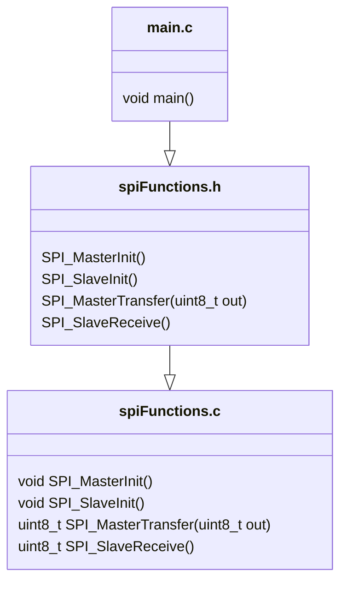
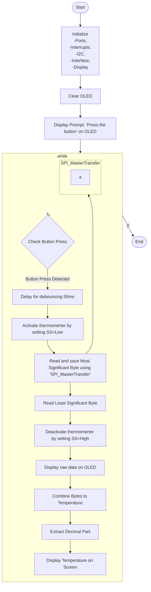

```mermaid
classDiagram

main.c --|> spiFunctions.h
spiFunctions.h --|> spiFunctions.c

class main.c{
    void main()
}

class spiFunctions.h{
    SPI_MasterInit()
    SPI_SlaveInit()
    SPI_MasterTransfer(uint8_t out)
    SPI_SlaveReceive()
}

class spiFunctions.c{
    void SPI_MasterInit()
    void SPI_SlaveInit()
    uint8_t SPI_MasterTransfer(uint8_t out)
    uint8_t SPI_SlaveReceive()
}

```

```mermaid
flowchart TD
    A([Start]) --> C
    C["`Initialize
    -Ports,
    -Interrupts,
    -I2C,
    -Interface,
    -Display`"]
    C --> D[Clear OLED]
    D --> E[Display Prompt: 'Press the button' on OLED]
    E --> while

    while -->|1| F{Check Button Press}
    while -->|0| bb([End])


subgraph SPI_MasterTransfer

    a

end

subgraph while


    F -->|Button Press Detected| G[Delay for debouncing 50ms]
    G --> H[Activate thermomerter by setting SS=Low]
    H --> I[Read and save Most Significant Byte using 'SPI_MasterTransfer'] --> SPI_MasterTransfer
    I --> J[Read Least Significant Byte]
    J --> K[Deactivate thermomerter by setting SS=High]

    K --> L[Display raw data on OLED]
    L --> M[Combine Bytes to Temperature]
    M --> N[Extract Decimal Part]
    N --> O[Display Temperature on Screen]


end

```
![[Flowchart opg3.canvas]]
